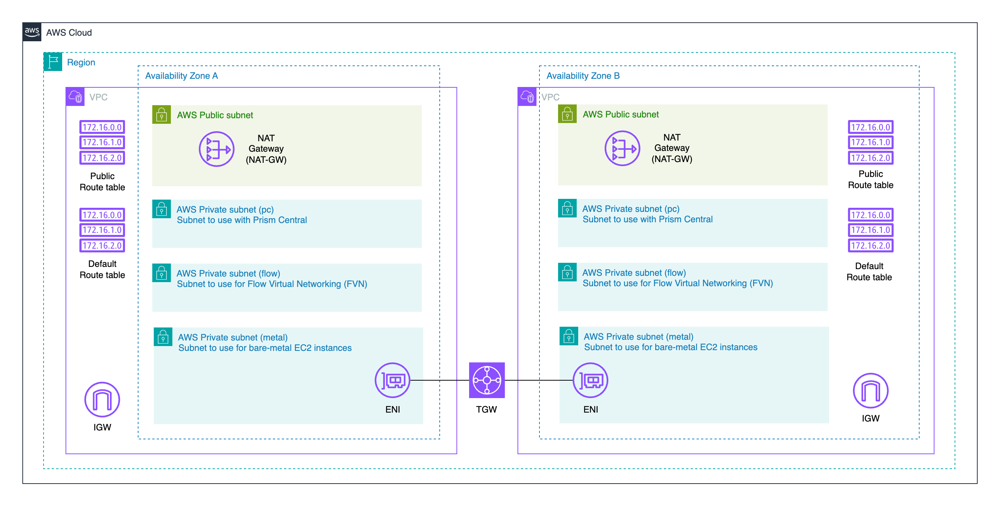

# AWS VPC Network Configuration for NC2 DR

This Terraform configuration creates a landing zone for two NC2 clusters configured for Disaster Recovery. It comes with flexible configuration options allowing for single or multi-region with TGW or VPC peering. 

- Two VPCs with configurable regions
- Public and private subnets in each VPC
- VPC peering or Transit Gateway connectivity options
- Internet and NAT Gateway configurations
- DNS support enabled
- Consistent naming and tagging

## Deployment Scenarios with Configuration options

### 1. Same Region, VPC Peering

This scenario deploys both VPCs in the same region with VPC peering for connectivity.

| tfvars variable | Setting | 
|----------|-------------|
| vpc1_region | ap-northeast-1 | 
| vpc2_region | ap-northeast-1 | 
| vpc1_cidr | "10.101.0.0/16" | 
| vpc2_cidr | "10.102.0.0/16" | 
| peering_type | vpc | 
| vpc1_az | ap-northeast-1a | 
| vpc2_az | ap-northeast-1c | 


### 2. Same Region, TGW Peering

This scenario deploys both VPCs in the same region with VPC peering for connectivity.

| tfvars variable | Setting | 
|----------|-------------|
| vpc1_region | ap-northeast-1 | 
| vpc2_region | ap-northeast-1 | 
| vpc1_cidr | "10.101.0.0/16" | 
| vpc2_cidr | "10.102.0.0/16" | 
| peering_type | tgw | 
| vpc1_az | ap-northeast-1a | 
| vpc2_az | ap-northeast-1c | 



### 3. Cross-Region, VPC Peering

This scenario deploys VPCs in different regions with Transit Gateway peering for connectivity.

| tfvars variable | setting | 
|----------|-------------|
| vpc1_region | ap-northeast-1 | 
| vpc2_region | ap-northeast-3 | 
| vpc1_cidr | "10.101.0.0/16" | 
| vpc2_cidr | "10.102.0.0/16" | 
| peering_type | vpc | 
| vpc1_az | ap-northeast-1a | 
| vpc2_az | ap-northeast-3a | 


### 4. Cross-Region, TGW Peering

This scenario deploys VPCs in different regions with Transit Gateway peering for connectivity.

| tfvars variable | setting | 
|----------|-------------|
| vpc1_region | ap-northeast-1 | 
| vpc2_region | ap-northeast-3 | 
| vpc1_cidr | "10.101.0.0/16" | 
| vpc2_cidr | "10.102.0.0/16" | 
| peering_type | tgw | 
| vpc1_az | ap-northeast-1a | 
| vpc2_az | ap-northeast-3a | 


### Subnet Structure

Each VPC contains:
- 1 public subnet
- 3 private subnets (metal, pc, flow)
- All subnets are /24 CIDR blocks

| Subnet suffix | Description | Type |
|----------|-------------|-------------|
| pc | Subnet for Prism Central | Private |
| metal | EC2 bare-metal server subnet | Private |
| flow | Flow Virtual Networking subnet | Private |
| public | Internet access for cluster | Public |


### Route Tables

- Public subnets: Custom route table with route to Internet Gateway
- Private subnets: Default route table with route to NAT Gateway

### Connectivity Options

1. VPC Peering:
   - Direct connection between VPCs
   - Works in same region or cross-region
   - Simpler configuration
   - Lower cost/h but higher data transfer costs

2. Transit Gateway:
   - Hub-and-spoke architecture
   - Better for multiple VPCs
   - Required for cross-region connectivity
   - More complex but more scalable
   - Higher cost/h but lower data transfer costs


## Usage

1. Configure variables in `terraform.tfvars`:
```hcl
project_prefix = "nc2"
vpc1_region    = "ap-northeast-1" # can use same or different region for vpc 1 and 2
vpc2_region    = "ap-northeast-1" # can use same or different region for vpc 1 and 2
vpc1_cidr      = "10.101.0.0/16"
vpc2_cidr      = "10.102.0.0/16"
peering_type   = "vpc"  # or "tgw"
vpc1_az        = "ap-northeast-1a" # align with regions for vpc1
vpc2_az        = "ap-northeast-3a" # align with regions for vpc2
```

2. Initialize and apply:
```bash
terraform init
terraform plan -out nc2.plan
terraform apply nc2.plan
```

## Notes

- DNS hostnames and support are enabled by default
- NAT Gateways are placed in public subnets
- Private subnets use the VPC's default route table
- All resources are tagged with the project prefix
- Cross-region deployments require Transit Gateway peering 

## More info at

Please visit [jonamiki.com](https://jonamiki.com) for more NC2 and AWS info
